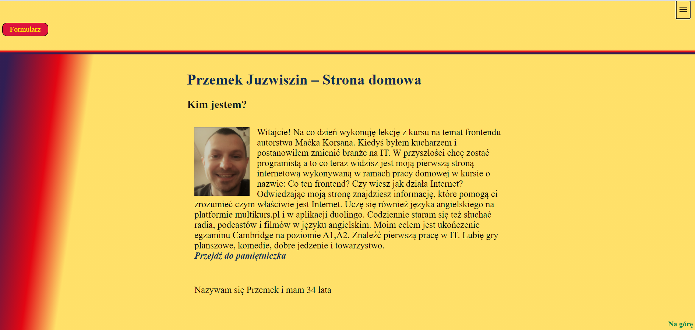

# My first steps with frontend. 🏗

Please visit my website: [First homepage Przemysława Juzwiszin](https://przemekjuzwiszin.github.io/homepage-2-pd/src/content/) 

## To work on this page I used: 🛠

1. Visual Studio Code.

2. Git.

3. Trello (KANBAN method).

4. Windows Terminal.

5. BEM.

### I relied on four languages. .🗺

- HTML

- CSS

- JavaScript

- Markdown
